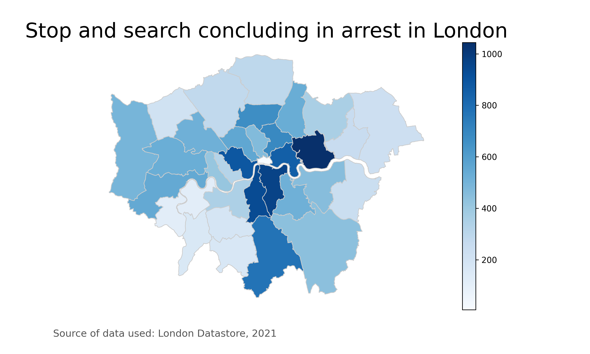

# Analysis of socieconomical bias by the police in London, UK
> A study on how socio economical status affects police decisions during stop and search procedures in London

## Table of contents
* [General info](#general-info)
* [Images](#images)
* [Setup](#setup)
* [Code examples](#code-examples)
* [Status](#status)
* [Contact](#contact)

## General info
In progress.

## Images

## Setup
* Python= 3.x.x
* Pandas=1.2.1
* ScikitLearn=0.24.1
* Numpy=1.19.5
* DoWhy=0.6.0
* Matplotlib=3.2.2
* Seaborn=0.11.1

## Code Examples
* How to use function to show linear relationship, avaliable in 'visualize.py':

## To-do list:
* Understand DoWhy library
* More research on casual inference
* Get more data processed and ready
* Any extra preliminary visualization

## Status
Project is: _in progress_
Currently researching and preparing data.

## Contact
Created by Jeronimo Oliva Cano
