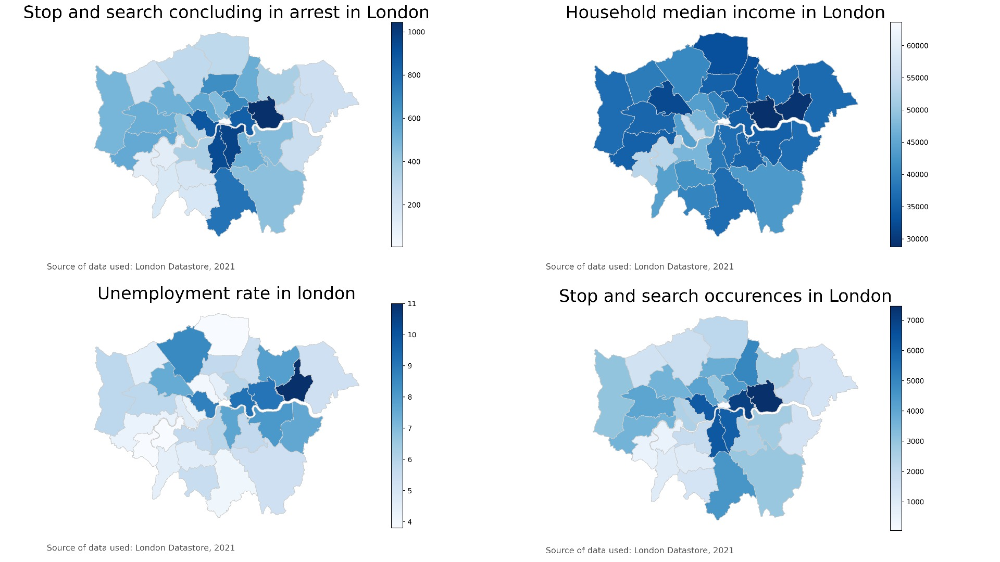
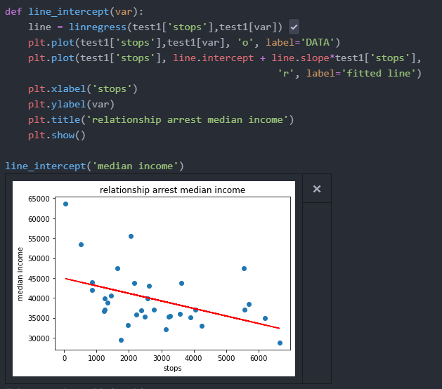

# Analysis of socieconomical bias by the police in London, UK
> A study on how socio economical status affects police decisions during stop and search procedures in London

## Table of contents
* [General info](#general-info)
* [Images](#images)
* [Setup](#setup)
* [How to](#how-to)
* [Code examples](#code-examples)
* [External resources](#external-resources-used)
* [Status](#status)
* [Contact](#contact)

## General info
A study on police bias in London , with an emphasis in socioeconimcal status. Focusing on casual inference and utilizing the DoWhy library to find relevant information.

## Images

## Setup
* Python= 3.x.x
* Pandas=1.2.1
* ScikitLearn=0.24.1
* Numpy=1.19.5
* DoWhy=0.6.0
* Matplotlib=3.2.2
* Seaborn=0.11.1
* Scipy=1.6.0
> can be installed using: 
>> pip install -r /path/to/requirements.txt

## How to
Section to write the correct steps to execute all code, essentially a guide on how to use the available data to produce the results in the paper
## Code Examples
* How to use function to show linear relationship, avaliable in 'visualize.py':

## External resources used 
* https://github.com/Microsoft/dowhy , Dowhy library.
* http://geodojo.net/uk/converter/ , Geodojo to convert latitude/longitude to postcodes.
* https://data.london.gov.uk/dataset/ , London Datastore to obtain relevant borough information.
* https://data.police.uk/data/,  Monthly databases of stop and search occurences.

## To-do list:
- [x] Understand DoWhy library
- [ ] More research on casual inference
- [ ] Get more data processed and ready
- [ ] Any extra preliminary visualization
- [ ] Implement dowhy in available data
- [ ] write relevant results 

## Status
Project is: _in progress_ 
Currently researching and preparing data.

## Notes
To be updatated when the new census(2021) data becomes available.
## Contact
Created by Jeronimo Oliva Cano   E-mail: jo20296@essex.ac.uk
